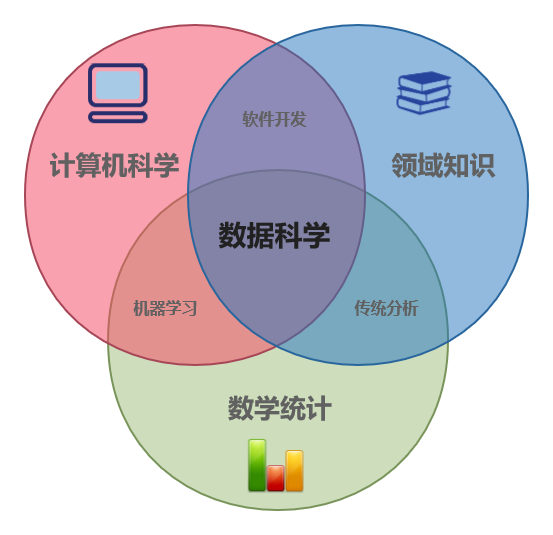

# R语言介绍

## 数据科学

### 数据科学的定义

数据科学是一门使用现代信息技术和工具来处理大量数据，从而发现数据中潜在的的模式并获取有意义的信息从而做出实际业务中的关键决策的研究领域。它基于传统的数学统计知识和现代快速发展的信息科技，使用复杂的机器学习算法针对相关领域的实际问题来建立相关模型并进行挖掘和分析，是一个高度综合、交叉的学科。也正是因为其高度的学科交叉特性，数据科学可以结合数理统计、数据分析、机器学习和专业知识等多方面信息，从已有的数据中挖掘出常规学科无法获取的知识。数据科学的生命周期包括捕获、维护、处理、分析和最终的交流，可以辅助决策者做出明智准确的商业判断。

### 数据科学与计算机科学、数理统计、机器学习等概念的区别

计算机科学是研究计算、自动化和信息的科学，其跨越理论学科(如算法、计算理论、信息论和自动化)到实践学科(包括硬件和软件的设计和实现)，核心问题是算法和数据结构。

数理统计学是应用数学的一个分支，涉及从定量数据中收集、描述、分析和推论结论，其背后的数学理论很大程度上依赖于微积分、线性代数和概率论。

专业知识又被称为经验、知识，是人类在实际生产活动中从实践中获得的经验和知识，他们往往是常规场景下进行判断和决策的重要依据。

学科的交叉融合可以产生新学科，机器学习和数据科学等就由此而来。基于已有的知识和经验，使用统计学手段研究实际问题是传统分析；利用计算机科学和专业知识解决问题的过程被称为软件开发；计算机科学与数理统计相结合则产生了机器学习。而数据科学，则是融合数理统计、计算机科学和专业知识等为一体的高度交叉学科。

### 数据科学的重要价值

随着科技的不断进步，现代技术能够产生和存储越来越多的信息，数据量呈现爆炸式增长，许多公司都因此拥有极为丰富的数据宝库。据估计，目前世界上90%的数据都是在过去两年内产生的，比如Facebook用户每小时可以上传高达1000万张图片，微信每天有多达450亿次消息发送，有约4.1亿次音视频呼叫成功。但遗憾的是，公司所产生的绝大部分数据都往往只是存放在数据仓库中，无法得到有效利用。

事实上，通过已有技术收集和存储的大量数据可以为世界各地的组织和社会带来变革性的好处-但前提是我们能够处理和解释这些数据，这就是数据科学的用武之地。数据科学可以用于揭示数据中蕴含的趋势和规律，进而辅助企业决策层做出更好的决策，创造更多创新的产品和服务。更加重要的是，数据科学可以利用机器学习模型从海量的数据输入中不断学习新的知识，这相比传统的业务模式-主要依赖于业务分析人员从少量数据中得到新发现新知识，有巨大的优势。因此，数据是创新的基石，但它的价值来自其中蕴含的信息和规律，而这个过程离不开数据科学。

### 数据科学的生命周期

数据科学的生命周期主要分为五个独立的阶段，每一阶段都有其特定的任务。

+ 捕获：捕获阶段主要集中在收集结构化和非结构化的数据，包括数据采集、数据输入、信号接收和数据提取等。

+ 维护：维护阶段主要是获取原始数据，并进行一定程度的预处理，然后将数据以方便实用的形式妥善保存在安全的介质中。包括建立和维护数据仓库、数据清洗、数据分级、数据预处理、设计数据架构等。

+ 处理：处理阶段主要是数据科学家基于准备好的数据，检查数据模态、范围和偏差来决定数据在实际应用中的有效性。包括数据建模和数据汇总等。

+ 分析：分析是数据科学中的主要阶段之一，涉及到对数据的探索性或验证性分析，进行数据分析和数据挖掘。包括预测分析、回归分析、文本挖掘等。

+ 交流：交流是数据科学生命周期的最后一阶段，分析人员以易于理解和阅读的方式（如图表和报告等）汇报和讲解分析结果。包括数据可视化、商务决策等。

## 数据分析与挖掘流程

### 数据分析

数据分析是一个检查、清理、转换和建模数据的过程，目的是发现有用的信息，为结论提供依据，并起到辅助决策过程的作用。数据分析包含多个方面和多种方法，包括不同名称下的各种技术，并用于不同的商业、科学和社会科学领域。在当今的商业世界中，数据分析在做出更科学的决策和帮助企业更有效地运营方面发挥着重要作用。

### 数据分析流程

总体来说，数据分析是一个获取原始数据然后将其转化为对决策者用用的信息的过程，主要包含八个阶段.

+ 数据要求：数据作为分析流程的输入时必须的，而且是根据指导分析的人(或将使用分析产生的最终产品的客户)的需求指定的。数据可以是数字的，也可以是分类的(比如数字的文本标签)。

+ 数据收集：数据可以从各种来源收集，根据数据分析者所处的专业领域不同而变化。一般而言，原始数据可从环境中的传感器收集，包括交通摄像机、卫星、记录设备等，比如足球和篮球等体育数据可以通过摄像传感器记录保存。如果对数据的质量要求不高，也可以选择通过文档、图标等网络资源中获取二手乃至多手数据。

+ 数据处理：最初获得的数据必须经过标准化处理以进行分析。例如，最常见数据处理要求就是以表格形式(称为结构化数据)将数据放入行和列中以供进一步分析，通常是通过使用电子表格或统计软件来进行。

+ 数据清洗：经过数据处理后，所得到的结构化数据可能是不完整的，也可能存在冗余和错误等情况，这往往可能是因为数据输入和存储的方式存在问题，因此需要对数据进行数据清洗，从而防止和纠正这些错误。数据清洗常见的任务包括记录匹配、识别不准确数据、判断现有数据的整体质量、删除重复数据和识别异常数据。比如常见的异常值检测定量数据方法可以用于去除异常数据。

+ 数据探索性分析：数据集被清理干净后，就可以开展多种类型的探索性分析。分析人员可以应用包括统计学方法在内的各种技术，称为探索性或者描述性数据分析，来理解所获得的数据中包含的基本信息。常见的可以利用最基本的数据统计量，即平均数、中位数和众数等来了解数据的基本统计学描述。

+ 数据建模分析：可以利用相关数理统计模型或者机器学习算法来对数据分析，进而确定变量之间的关系，这是对数据进行深入建模分析的过程。一般来说，模型可以根据数据集中包含的其他变量来评估特定的变量，但是模型与数据之间往往会存在一定的偏差数据=模型+误差，例如使用回归模型探索某个变量与其他所有变量之间的相关关系，分析人员往往用残差来代表数据和模型之间的误差。

+ 数据产品：数据产品一般是一种基于某种模型或算法的计算机应用程序，它接受数据输入并生成输出，然后将它们反馈给环境。例如，一个分析客户购买历史数据的应用程序，可以基于其底层的推荐算法为客户推荐其可能喜欢的其他商品。

+ 数据交流：数据分析完成之后，可能以多种格式报告给需求方客户，以支持其相关决策。另一方面，客户可能会对数据分析的结果产生反馈，从而产生额外的数据分析需求，这也是为什么很多数据分析流程呈现周期性、迭代性特征。

### 数据挖掘

数据挖掘是在大规模数据集中提取和发现模式和规律的过程，是涉及机器学习、数理统计和数据库系统的交叉方法，也是计算机科学和统计学的一个跨学科交叉领域。数据挖掘总体目标是从数据集中提取潜在的信息和模式，并将信息转化为可理解的结构以供进一步使用。实际的数据挖掘任务是对大量数据进行半自动或自动分析，以提取以前未知的、有趣的模式，如数据集群发现(聚类分析)、异常记录(异常检测)和依赖性(关联规则挖掘、顺序模式挖掘)。数据分析最常用的六类任务分别是：

+ 异常检测：异常检测又称异常值/偏差检测，需要识别出有待进一步调查的数据错误。

+ 关联规则学习：关联规则学习是对依赖性建模的过程，用于探索变量之间的关系。比如，一家超市可能会收集有关顾客购买习惯的数据，然后用通过关联规则学习，可以确定哪些产品经常被一起购买，并将这些信息用于营销。

+ 聚类：聚类是在不使用数据中的已知结构的条件下，发现数据中相似的集群或者社区的任务。

+ 分类：分类是将已知结构一般化以应用于新数据的任务。例如，一个电子邮件程序可能根据历史垃圾邮件记录，试图将一封电子邮件分类为“合法”或“垃圾邮件”。

+ 回归：回归试图找到函数，该函数在某种误差最小度量下对数据进行拟合建模，比兔线性回归和逻辑回归等。

+ 总结：提供更紧凑的数据集表示，包括可视化和报告生成。

### 数据挖掘流程

按照跨行业数据挖掘标准流程(CRISP-DM)，一般数据挖掘的流程分成六个阶段，包括业务背景了解、数据理解、数据准备、建模、评价和部署。其基本过程与数据分析流程类似，这里不再赘述。

### 数据分析与数据挖掘的比较

数据分析和数据挖掘的区别在于，数据分析用于测试数据集上的模型和假设，例如，分析营销活动的有效性，并且数据分析往往不考虑数据量。相比之下，数据挖掘使用机器学习和统计模型来揭示大量数据中的秘密或隐藏模式，即数据挖掘一方面更侧重于发现未知模式，另一方面往往侧重于应用于大数据。
