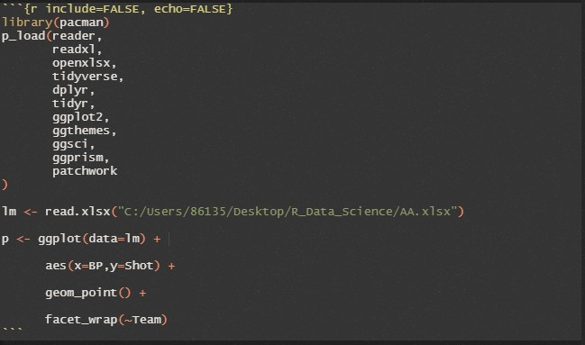

# 数据交流

## R markdown

R markdown可以生成可重复性报告，是R语言社区重要的交流工具。在学习R markdown之前，我们首先需要了解一下Markdown。

### Markdown介绍

Markdown是一种轻量级标记语言，可以使用它在纯文本文档添加格式化元素。Markdown由John Gruber在2004年创建，目前是世界上最流行的标记语言之一。与常见的office文本编辑器(如Microsoft word等)不同，在Markdown中对文本格式的更改并不是立即可见的。Markdown的运行逻辑是：在创建Markdown格式的文件时，用户可以在纯文本中添加Markdown语法，以指示哪些单词和短语应该以何种方式进行格式化。

例如，要表示一级标题，我们可以在一级标题前面添加符号\#(例如\# 一级标题)。或者想让一个短语加粗，我们可以在短语前面和后面各加两个星号(例如，\*\*这个文本是加粗的\*\*)


### Markdown的优越性

前面提到，Markdown已经是世界上最流行的轻量级标记语言之一。你可能会问，常见的所见即所得文本编辑器不是更好吗？为什么要使用Markdown呢？其相对于Microsoft word等一类的文本编辑器有何优越性呢？事实上，Markdown确实存在其诸多优越性，主要体现在如下五个方面：

+ Markdown几乎可以用于任何文本编辑场景。包括创建网站、文档、笔记、书籍、演示文稿、电子邮件信息和技术文档等。

+ Markdown拥有极强的可移植性。包含markdown格式文本的文件几乎可以使用任何应用程序打开。因此如果你不喜欢当前的Markdown应用程序，你可以将Markdown文件导入至另一个Markdown应用程序。相比较而言，Microsoft word等文字处理应用程序将内容锁定为专有文件格式，为处理文本带来诸多不便。

+ Markdown拥有极强的跨平台特性。因此，可以在任何操作系统的设备上创建markdown格式的文本并编辑。

+ Markdown具有更加可靠的可持续性。既是当前的Markdown应用程序在将来某个时候停止工作，我们仍然可以使用文本编辑应用程序呈现和阅读markdown格式的文本。当涉及到书籍、论文和其他需要无限期保存的文件时，这是一个重要的因素。

+ Markdown使用范围广。我们几乎可以在任何地方看见Markdown的存在，像Reddit和GitHub这样的网站支持Markdown语法，许多桌面和基于网络的应用程序也支持它，用户还可以在macOS, Windows, Linux, iOS和Android等操作系统的设备上选择众多Markdown应用程序进行使用，而且还有一些基于web的应用程序专门为Markdown编写而设计。


根据所使用应用程序的不同，用户在使用Markdown时可能无法实时预览格式化的文档。但是没关系，根据Gruber的说法，Markdown语法被设计成可读且不引人注目的，因此Markdown文件中的文本即使没有呈现也可以被轻松阅读。

### Markdown语法介绍

Markdown提供了多样全面的格式化选项，如下表所示：

| 格式化选项 | Markdown语法 |
| :---: | :--: |
| <br>标题<br> | # 一级标题<br>## 二级标题<br>### 三级标题 |
| 加粗 | \*\*加粗字体\*\* |
| 斜体 | \*倾斜字体\* |
| 引用 | > 引用 |
| <br>有序列表<br> | 1. 第一<br>2. 第二<br>3. 第三 |
| <br>无序列表<br> | - 第一<br>- 第二<br>- 第三<br> |
| 代码 | \`print("你好,世界")\` |
| 超链接 | [超链接\](https://www.tsinghua.edu.cn/) |
| 图片 |  |
| <br>表格<br>| \| 字段1 \| 字段2 \|<br> \| \-\-\- \| \-\-\- \|<br> \| 内容1 \| 内容2 \| |

这里我们只是对Markdown的一些常见语法进行了基本介绍，关于Markdown语法的系统性学习请读者自行参考相关拓展资料。

### 从Markdown到R markdown

Markdown虽然能够对文本轻松进行格式化操作，但是却无法直接运行R代码。于是，为了方便R社区中代码展示和文本格式化的双重需求，R markdown应运而生。R markdown集成了Markdown的内部语法，能够保留Markdown语法进行文本格式化，并在此基础上同时允许直接运行R代码块、展示运行结果和格式化代码块运行结果。用户可以通过如下方式插入并运行R代码块:

<p align="center">

</p>

代码块头部花括号内可以设置代码块展示选项，相应的参数包括：

- `echo`：在报告中是否展示代码块，默认为`TRUE`
- `include`: 在报告中是否展示代码块以及代码运行的结果，默认为`TRUE`
- `eval`: 是否运行代码块，默认为`TRUE`
- `tidy`: 是否在显示代码的时候进行formatR对R源代码进行格式化处理，默认为`FALSE`
- `warning`: 是否在报告中显示警告信息，默认为`FALSE`
- `error`: 发生错误时是否继续运行代码块，默认为`FALSE`
- `results`: 该参数用于控制文本输出是否显示以及如何显示,有四个选项，包括`markup`, `asis`, `hold`和`hide`。`markup`选项代表对输出做一定的修饰，比如对输出的向量加上代码块的符号，是默认选项；`asis`是非常有用的选项，可以在代码结果中引入Markdown语法，代码的输出结果可以生成标题；`hold`会将代码的输出文本收集起来，并在文件最后进行输出；`hide`表示隐藏文本输出。
- `fig.show`：该参数用于控制图片输出是否显示以及如何显示，也有四个选项，包括`asis`, `hold`, `hide`和`animate`。其中`asis`是默认选项，即显示图片并将其放置在代码生成的位置；`hold`和`hide`的含义同上；`animate`选项可以将生成的多幅图片转换为动画。
- `fig.height`：控制输出图片的物理高度
- `fig.width`：控制输出图片的物理宽度
- `out.height`：控制输出图片的相对显示高度
- `out.width`：控制输出图片的相对显示宽度

完成R markdown的编写后，我们可以在文件的头部添加标题、作者、日期和输出格式等选项，其中输出支持html，pdf和word等多种格式。比如如下的设置标明了作者信息并指定输出格式为html：

```
---
title: "R markdown"
author: "Tsinghua University"
date: "2022-10-26"
output: html_document
---
```


## R website

在前面我们讲到了使用blogdown制作博客
